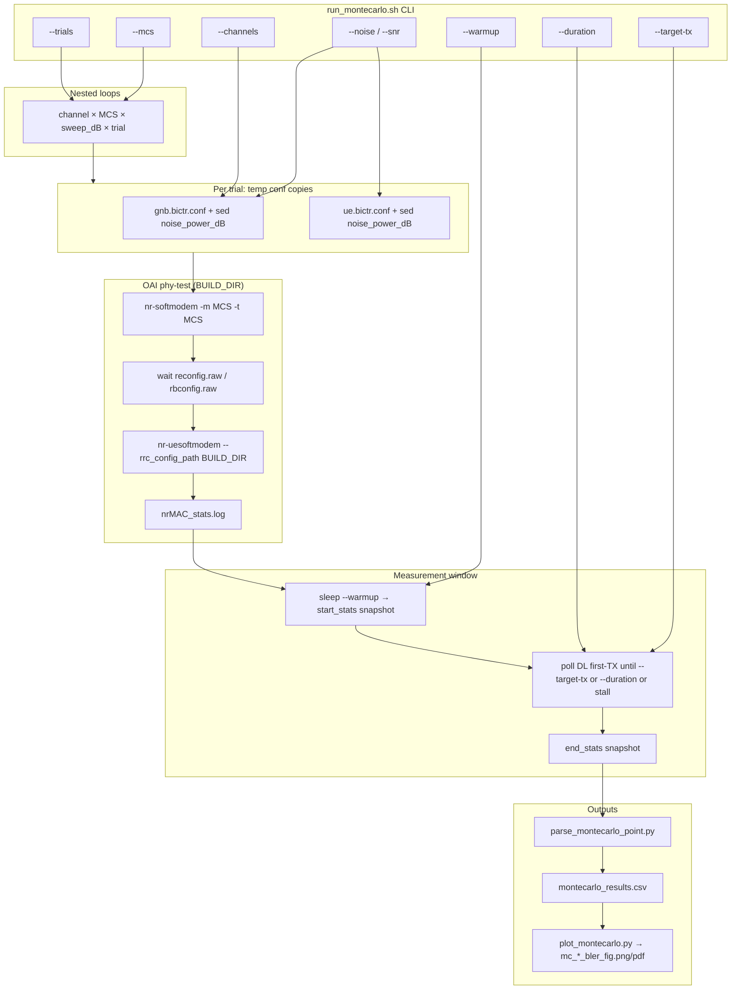

# BICTR Monte Carlo BLER sweeps (EpiSys / OAI)

Cellular **phy-test** Monte Carlo over the **BICTR lunar** channel (`BICTR_LUNAR`) using OAI RFSim.
Produces `montecarlo_results.csv` and BLER vs SINR waterfall plots (`mc_*_bler_fig.png/pdf`).

> **Note:** This path is **Uu cellular** (`nr-softmodem` + `nr-uesoftmodem`, `--phy-test --noS1`).
> It is **not** NR sidelink Mode 2 (`--sl-mode 2`). For sidelink, see `README_SL.md`.

**Canonical scripts:** `bictr_analysis/` (archived variants live in `old/`).

---

## Active files

| File | Role |
|------|------|
| `bictr_analysis/run_montecarlo.sh` | Sweep driver — parses CLI flags, runs OAI, appends CSV rows |
| `bictr_analysis/parse_montecarlo_point.py` | Per-trial delta BLER from `nrMAC_stats.log` snapshots |
| `bictr_analysis/plot_montecarlo.py` | BLER waterfall curves + summary tables from CSV |
| `bictr_analysis/run_montecarlo_rsl.sh` | **Resilient** long-run driver — same BLER sweep as above, with retries, resume, and per-trial logs (`*_rsl/` output) |
| `bictr_analysis/mc_trial_logs.sh` | Archives per-trial `gnb.log` / `bictr_verify.txt` under `trial_logs/` |
| `bictr_analysis/verify_phytest_mcs.sh` | Standalone check that OAI `-m`/`-t` change reported MCS |
| `bictr_analysis/phytest_rrc/` | `reconfig.raw`, `rbconfig.raw` seeds for phy-test UE |
| `targets/PROJECTS/GENERIC-NR-5GC/CONF/gnb.sa.band78.fr1.106PRB.usrpb210.bictr.conf` | gNB template (BICTR channelmod) |
| `targets/PROJECTS/GENERIC-NR-5GC/CONF/ue.bictr.conf` | UE template (BICTR channelmod) |

Build output (default): `cmake_targets/ran_build/build/` (`nr-softmodem`, `nr-uesoftmodem`, `nrMAC_stats.log`).

---

## End-to-end flow



**Sweep axis (BICTR_LUNAR):** `--noise` writes `noise_power_dB` into gNB/UE conf copies → OAI **channelmod** applies noise. Plots use **SINR (dB) = −noise_power_dB** on the x-axis.

**Sweep axis (AWGN):** `--channels AWGN` uses `*.awgn.conf` and passes **`-s SWEEP_DB`** to gNB/UE (phy-test AWGN SNR). CSV column is still named `noise_power_dB` but stores SINR dB.

---

## Quick start (recent preset)

One trial per (MCS, noise) cell, ~100 DL first-TX per trial:

```bash
cd openairinterface5g/bictr_analysis

sudo ./run_montecarlo.sh \
  --mcs 9,20 \
  --noise 8,6,4,2,0,-2,-4,-6,-8,-10,-12,-14,-16,-18,-20,-22,-24,-26,-28,-30 \
  --trials 1 \
  --target-tx 100 \
  2>&1 | tee "montecarlo_results/run_$(date +%Y%m%d_%H%M%S).log"
```

Plot:

```bash
LATEST="$(ls -td montecarlo_results/*/montecarlo_results.csv 2>/dev/null | head -1)"
python3 plot_montecarlo.py "$LATEST" -o "$(dirname "$LATEST")"
```

Results: `bictr_analysis/montecarlo_results/<timestamp>/` (gitignored).

For long grids (MCS 9–28 × many noise points), use the **resilient** driver below instead of `run_montecarlo.sh` — see [What is the RSL script?](#what-is-the-rsl-script).

---

## What is the RSL script?

**`run_montecarlo_rsl.sh`** is the **resilient** variant of the Monte Carlo BLER sweep. **RSL** here means *resilient* (output folders are named `<timestamp>_rsl` under `montecarlo_results_rsl/`). It is **not** a different channel model or metric: it runs the same phy-test OAI setup, the same BICTR lunar configs, and produces the same `montecarlo_results.csv` and plots as `run_montecarlo.sh`.

Use it when a sweep is **long or fragile** — for example MCS 9–28 × 20 noise points × many trials. In those runs, individual trials can **stall** (no DL traffic), **time out** before `--target-tx`, or leave **stuck `nr-softmodem` processes** after a crash or Ctrl+C. The standard script stops or loses progress; the RSL script is built to keep the grid moving and let you **continue later**.

| | `run_montecarlo.sh` | `run_montecarlo_rsl.sh` |
|--|---------------------|-------------------------|
| **Purpose** | Short or interactive sweeps | Overnight / multi-hour grids |
| **On failure** | One attempt per cell; partial CSV row | Retries the same cell (default 3×), kills OAI between tries |
| **After interrupt** | Resume only if you reuse the same output dir / `MC_RUN_DIR` | **`--resume-dir`** skips completed CSV rows and continues |
| **Output dir** | `montecarlo_results/<timestamp>/` | `montecarlo_results_rsl/<timestamp>_rsl/` |
| **Extra artifacts** | CSV (+ optional `run.log`) | CSV, `rsl_events.log`, `trial_logs/` (gNB logs for DEM verification), `bictr_terrain_index.tsv` |

For a **quick** curve (e.g. two MCS values, one trial per point), either script works; for a **full BICTR assessment**, use RSL.

---

## Resilient sweeps (`run_montecarlo_rsl.sh`)

Same measurement as the standard driver. Additional behavior:

| Behavior | Detail |
|----------|--------|
| **Per-trial retries** | Up to `--max-retries` attempts (default **3**) on stall, timeout before `--target-tx`, or bring-up failure |
| **Process cleanup** | `force_kill_oai` between attempts so hung `nr-softmodem` / UE do not block the next trial |
| **Resume** | `--resume-dir` reuses an existing `montecarlo_results_rsl/<timestamp>_rsl/` folder; rows already in `montecarlo_results.csv` are **skipped** |
| **Failed trials** | No CSV row until success or the final retry; re-run with `--resume-dir` to retry failed cells |
| **Event log** | `rsl_events.log` in the run directory (stall / timeout / give-up lines) |
| **Trial logs** | `trial_logs/<channel>_mcs<N>_np<dB>_t<T>/` with `gnb.log`, `ue.log`, conf copies, `bictr_verify.txt` (`[BICTR]` lines), `meta.txt` |
| **Terrain index** | `bictr_terrain_index.tsv` — one row per archived trial (`dem_mode`: DEM / FLAT / FLAT_FALLBACK) |

**Output:** `bictr_analysis/montecarlo_results_rsl/<timestamp>_rsl/montecarlo_results.csv` (gitignored).

Trial logs are **on by default** (~hundreds of MB for a full 400-cell grid). Disable with `--no-save-trial-logs`. RSL retry attempts are archived only on the **final** attempt unless `--save-all-attempts`.

### Start a resilient sweep

```bash
cd openairinterface5g/bictr_analysis

sudo ./run_montecarlo_rsl.sh \
  --noise 8,6,4,2,0,-2,-4,-6,-8,-10,-12,-14,-16,-18,-20,-22,-24,-26,-28,-30 \
  --trials 1 \
  --target-tx 100 \
  2>&1 | tee "montecarlo_results_rsl/run_$(date +%Y%m%d_%H%M%S).log"
```

Default MCS range is **9–28** (omit `--mcs` for full grid). Plot when done:

```bash
python3 plot_montecarlo.py montecarlo_results_rsl/<timestamp>_rsl/montecarlo_results.csv \
  -o montecarlo_results_rsl/<timestamp>_rsl
```

### Resume after interrupt (Ctrl+C, crash, reboot)

1. Find the run folder: `ls -td montecarlo_results_rsl/*_rsl`
2. Re-launch with **`--resume-dir`** and the **same** `--noise`, `--mcs`, `--trials`, and `--target-tx` as the original run (defaults differ if you omit them).

```bash
cd openairinterface5g/bictr_analysis

# Optional: clear stray OAI from the interrupted session
sudo pkill -9 nr-softmodem 2>/dev/null; sudo pkill -9 rfsimulator 2>/dev/null; true

sudo ./run_montecarlo_rsl.sh \
  --resume-dir montecarlo_results_rsl/20260521_222458_rsl \
  --noise 8,6,4,2,0,-2,-4,-6,-8,-10,-12,-14,-16,-18,-20,-22,-24,-26,-28,-30 \
  --trials 1 \
  --target-tx 100
```

On startup you should see:

```text
Resuming run: existing CSV found at .../montecarlo_results.csv
  N trial rows already present; those will be skipped
```

Then `SKIPPED (resume: already in CSV)` for completed `(channel, mcs, noise, trial)` cells before new work continues.

**Resume rules**

- `--resume-dir` may be a path relative to `bictr_analysis/` or absolute.
- If the CSV exists with a valid header, **new rows append** to the same file; plots use the merged CSV.
- Do **not** change `--noise` or `--mcs` between start and resume unless you intend a different grid (skipped keys are `(channel, mcs, noise_power_dB, trial)`).
- RSL default `--noise` is **11 values** (`6,4,2,…,-20`); a 20-point list like the example above must be passed on **both** start and resume.

### RSL-only flags (in addition to `run_montecarlo.sh` flags)

| Flag | Default | Definition |
|------|---------|------------|
| `--max-retries` | `3` | Attempts per trial before logging give-up (no CSV row until success or final attempt) |
| `--resume-dir` | (none) | Existing `montecarlo_results_rsl/<timestamp>_rsl/` directory; do not create a new timestamp folder |
| `--no-save-trial-logs` | off | Skip `trial_logs/` archival (saves disk) |
| `--save-all-attempts` | off | Archive every RSL retry folder (`_attemptN` suffix), not only successful/final runs |

**Verify terrain after a run:**

```bash
RUN=montecarlo_results_rsl/20260521_222458_rsl
column -t -s $'\t' "$RUN/bictr_terrain_index.tsv" | head
grep 'DEM terrain mode' "$RUN/trial_logs"/*/bictr_verify.txt | head -3
```

All other flags (`--mcs`, `--noise`, `--snr`, `--trials`, `--target-tx`, `--warmup`, `--duration`, `--early-stop`, `--stall-timeout`, `--channels`) behave the same as `run_montecarlo.sh`.

---

## `run_montecarlo.sh` flags

All flags are parsed at the top of `run_montecarlo.sh` and drive the nested loop or each `run_single_point` invocation.

| Flag | Default | Definition | Where it connects in the flow |
|------|---------|------------|--------------------------------|
| `--mcs` | `9`…`28` (comma list) | NR MCS indices (38.214 Table 5.1.3.1-1) to test | Outer loop variable `MCS` → passed to **`nr-softmodem -m MCS -t MCS`** (DL/UL phy-test scheduler MCS). Also written to CSV column `mcs` and plot legend. |
| `--noise` | `6,4,2,0,-2,-4,-6,-8,-10,-14,-20` | **`channelmod` `noise_power_dB`** values for **BICTR_LUNAR** only | Loop variable `SWEEP_DB` → **`sed`** into temp `gnb.conf` / `ue.conf` copies. **Not** passed as `-s` on gNB (BICTR noise is in conf). CSV column `noise_power_dB`; plot x-axis = **−noise_power_dB** (SINR). |
| `--snr` | (none) | SINR in dB for **BICTR_LUNAR** Figure-7-style axis | Mutually exclusive with `--noise` on BICTR. Internally converted: `noise_power_dB = −SINR` then same path as `--noise`. |
| `--channels` | `BICTR_LUNAR` | Channel mode: `BICTR_LUNAR` or `AWGN` | Selects conf templates (`*.bictr.conf` vs `*.awgn.conf`) and sweep list (`NOISE_DB_VALUES` vs `SNR_DB_VALUES`). |
| `--trials` | `100` | Independent simulator runs per **(channel, MCS, sweep_dB)** cell | Innermost loop `TRIAL=1…NUM_TRIALS`; one OAI gNB+UE bring-up per trial; separate CSV row per trial. |
| `--target-tx` | `100` | Stop measurement after this many **DL first transmissions** (`dlsch_rounds[0]` delta) | Poll loop in `run_single_point`: exit when `CUR_DL_TX - START_DL_TX >= TARGET_TX`. Sets minimum statistics per trial. |
| `--warmup` | `12` | Seconds after UE start before **start** stats snapshot | `sleep WARMUP` before copying `nrMAC_stats.log` → `start_stats.txt`. Excludes RRC/scheduler startup from BLER. |
| `--duration` | `120` | Max measurement seconds if `--target-tx` not reached | Upper bound on poll loop; trial ends at timeout (may have fewer than `target-tx` TBs). |
| `--early-stop` | `0` (off) | After first N trials per cell, skip rest if all saturated or all clean | If first N trials all have DL BLER ≥ 0.99 or all ≤ 0.001, remaining trials for that (channel, MCS, sweep) are skipped. |
| `--stall-timeout` | `90` | Seconds with **no change** in DL first-TX count → abort trial | Poll loop stall detector; if stuck at 0 TX, parser result may be forced to BLER=1.0 (saturation). Exported as `STALL_TIMEOUT`. |
| `--no-plot` | off | Reserved / no auto-plot at end of shell script | Plotting is always manual via `plot_montecarlo.py` today. |
| `-h` / `--help` | — | Print script header options | — |

**Constraints**

- **BICTR_LUNAR:** use **`--noise`** OR **`--snr`**, not both.
- Must run as **root** (`sudo`) — script exits otherwise.
- Requires built binaries in `OAI_BUILD_DIR` (default `cmake_targets/ran_build/build`).

---

## Environment variables (not CLI flags)

| Variable | Default | Definition | Flow connection |
|----------|---------|------------|-----------------|
| `OAI_BUILD_DIR` | `cmake_targets/ran_build/build` | OAI build directory | `cd` before launching `nr-softmodem` / `nr-uesoftmodem`; location of `nrMAC_stats.log` and RRC raw files. |
| `MC_RUN_DIR` | `montecarlo_results/<timestamp>/` | Output directory for CSV and `run.log` | If set, all rows append to `MC_RUN_DIR/montecarlo_results.csv` (resume supported). |
| `OAI_RFSIM_PORT` | (unset → conf default) | RFSim TCP port for parallel workers | `sed` on temp confs + `nr-softmodem --rfsimulator.[0].serverport` (avoids port clashes). |
| `STALL_TIMEOUT` | `90` | Same as `--stall-timeout` | Stall detection in poll loop. |
| `GNB_RRC_WAIT_SEC` | `120` | Max wait for `reconfig.raw` / `rbconfig.raw` | After gNB start, before UE start; falls back to `phytest_rrc/` seeds. |

---

## OAI binary flags (inside each trial)

Set by `run_montecarlo.sh` when launching processes — **not** the same as shell `--mcs`.

| OAI flag | Binary | Definition | Connection |
|----------|--------|------------|------------|
| `-m <n>` | `nr-softmodem` | DL MCS for **phy-test scheduler** (`target_dl_mcs`) | Must match shell `--mcs` for that trial. Drives PDSCH MCS in `gNB_scheduler_phytest.c`. |
| `-t <n>` | `nr-softmodem` | UL MCS for phy-test scheduler (`target_ul_mcs`) | Usually same as `-m`. |
| `-s <dB>` | `nr-softmodem`, `nr-uesoftmodem` | phy-test AWGN SNR | **AWGN channel only** (`--channels AWGN`). BICTR uses conf `noise_power_dB` instead. |
| `-O <conf>` | both | Config file path | Temp copy with swept `noise_power_dB` (BICTR). |
| `--rfsim` | both | Use RF simulator radio | — |
| `--phy-test` | both | UP-only test mode, fixed scheduler | — |
| `--noS1` | both | No core network | — |
| `--rrc_config_path` | UE only | Directory with `reconfig.raw` / `rbconfig.raw` | `BUILD_DIR` after gNB writes or seeds RRC files. |

**Common mistake:** `--MCS` on `nr-softmodem` is **ignored**; only **`-m` / `-t`** apply.

---

## Verify MCS changes (independent of sweep scripts)

The CSV column `mcs` records what the **shell** requested. To confirm OAI **actually scheduled** that MCS (not just relabeling curves), use `verify_phytest_mcs.sh` — it does **not** call `run_montecarlo.sh`.

```bash
cd openairinterface5g/bictr_analysis
sudo ./verify_phytest_mcs.sh        # default: compare MCS 9 vs 20
sudo ./verify_phytest_mcs.sh 9 20   # explicit pair
```

For each probe the script:

1. Starts gNB + UE with BICTR conf and `-m`/`-t` set to the probe MCS
2. Waits `MEAS_SEC` (default 25 s), then reads `cmake_targets/ran_build/build/nrMAC_stats.log`
3. Parses DL/UL lines: `... BLER ... MCS <N>` (written from `sched_ctrl->dl_bler_stats.mcs` in phy-test)
4. Compares DL `dlsch_total_bytes` delta (higher MCS should move more bytes when the link is active)

**PASS:** stats report MCS 9 and MCS 20 when requested; **FAIL** if stats MCS does not match `-m`.

Manual spot-check during any run:

```bash
grep "MCS" cmake_targets/ran_build/build/nrMAC_stats.log
```

**OAI chain (for reference):**

```text
run_montecarlo.sh --mcs N  →  nr-softmodem -m N -t N
                         →  target_dl_mcs / target_ul_mcs
                         →  gNB_scheduler_phytest.c: sched_pdsch->mcs = target_dl_mcs
                         →  nrMAC_stats.log: "... BLER ... MCS N"
```

Different MCS values at the same `noise_power_dB` should also produce different BLER/HARQ in `montecarlo_results.csv`; that is indirect evidence only — the verifier reads OAI directly.

---

## CSV output columns

Written to `montecarlo_results/<timestamp>/montecarlo_results.csv`:

| Column | Source |
|--------|--------|
| `channel_type` | `--channels` (e.g. `BICTR_LUNAR`) |
| `mcs` | `--mcs` |
| `noise_power_dB` | `--noise` value or `−(--snr)` for BICTR; AWGN: phy-test `-s` dB |
| `trial` | Trial index 1…`--trials` |
| `dl_first_tx`, `dl_errors`, `dl_bler`, `dl_harq` | `parse_montecarlo_point.py` delta from `nrMAC_stats.log` |
| `ul_first_tx`, `ul_errors`, `ul_bler` | same parser (UL) |

`plot_montecarlo.py` aggregates rows with the same `(channel_type, mcs, noise_power_dB)` when multiple trials exist.

---

## `plot_montecarlo.py` flags

| Flag | Default | Definition | Flow connection |
|------|---------|------------|-----------------|
| `csv_path` | (required) | Path to `montecarlo_results.csv` | Input from `run_montecarlo.sh` output. |
| `--output` / `-o` | CSV parent dir | Directory for `mc_dl_bler_fig.png/pdf`, `mc_ul_bler_fig.png/pdf`, tables | — |
| `--channel` | auto (AWGN if present, else BICTR) | Which `channel_type` rows to plot | Filters CSV before aggregate/plot. |
| `--direction` | `DL` | `DL` or `UL` for primary curve | Also generates the other direction. |
| `--title` | auto | Custom figure title | — |
| `--log` | off | Log-scale y-axis for BLER | Useful post-waterfall. |

---

## `parse_montecarlo_point.py`

Called once per trial with two snapshot files:

```text
start_stats.txt  ← nrMAC_stats.log after --warmup
end_stats.txt    ← nrMAC_stats.log after measurement
```

Extracts OAI fields `dlsch_rounds`, `dlsch_errors`, `ulsch_rounds`, `ulsch_errors`, computes **delta** first-TX and:

```text
BLER = min(Δ(errors) / Δ(rounds[0]), 1.0)
```

stdout is appended to the CSV row by `run_montecarlo.sh`.

### Why BLER can exceed 1.0 before capping

The script uses **two independent OAI counters**:

| Counter | Meaning (approx.) |
|---------|-------------------|
| `dlsch_rounds` / `0` | First HARQ transmission attempts (`dl.rounds[harq->round]++` at round 0) |
| `dlsch_errors` | Cumulative DL NACK/feedback failures (`dl.errors++` on failed ACK) |

They are related but **not** defined as “one error per first-TX TB.” Over a short stats snapshot window you can get `Δerrors > Δrounds[0]` (e.g. **107 errors / 106 first TX → 1.009** in a real run) because of:

1. **Event mismatch** — An error can be counted on a NACK/DTX path without a matching round‑0 increment in the same 1 s sample.
2. **Snapshot timing** — Start/end copies of `nrMAC_stats.log` are not atomic; counters advance mid-slot.
3. **HARQ/feedback edge cases** — Retransmission and PUCCH handling can bump `errors` differently than `rounds[0]`.

Values **≥ 1** are stored as **1.0** (saturation). `plot_montecarlo.py` also clamps when aggregating/plotting.

---

## Resume and early-stop

### `run_montecarlo.sh` (standard)

- **Resume:** Point `MC_RUN_DIR` at an existing `montecarlo_results/<timestamp>/`, or re-run into the same directory so `montecarlo_results.csv` is found. Existing `(channel, mcs, noise_power_dB, trial)` rows are skipped.
- **Early-stop:** `--early-stop N` skips remaining trials for a cell after N consecutive saturated or clean results.

```bash
export MC_RUN_DIR="$(pwd)/montecarlo_results/20260521_155838"
sudo ./run_montecarlo.sh --noise 8,6,4,2,0,-2,-4,-6,-8,-10,-12,-14,-16,-18,-20,-22,-24,-26,-28,-30 --trials 1 --target-tx 100
```

### `run_montecarlo_rsl.sh` (resilient)

See [What is the RSL script?](#what-is-the-rsl-script) for when to use it vs the standard driver.

- **Resume:** Use **`--resume-dir montecarlo_results_rsl/<timestamp>_rsl`** (see [Resilient sweeps](#resilient-sweeps-run_montecarlo_rslsh)).
- **Retries:** Failed trials (stall / timeout) are retried automatically; only the resilient script writes `rsl_events.log`.
- **Early-stop:** Same `--early-stop` semantics as the standard driver.

---

## Archived tooling

Experiment scripts, Docker Monte Carlo, parallel MCS 0–28 drivers, and legacy READMEs (100×100 / 1000×1000 presets) are under **`old/`** at the repo root.

---

## See also

- `bictr_analysis/README.md` — short copy of this doc at the script location
- `radio/rfsimulator/README.md` — phy-test mode and OAI `-m`/`-t` options
- `doc/episys/README_SL.md` — NR sidelink (different stack)
